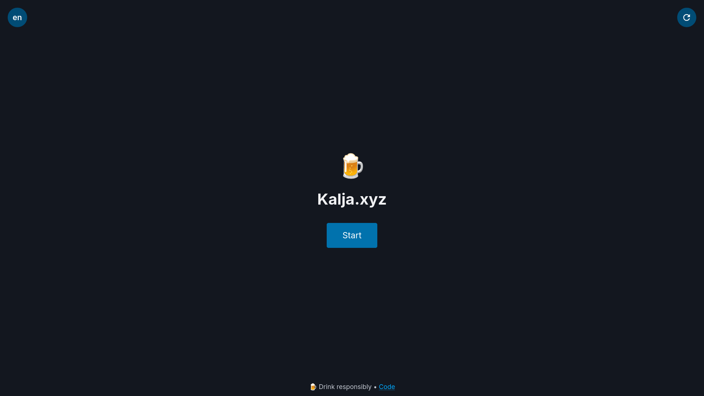
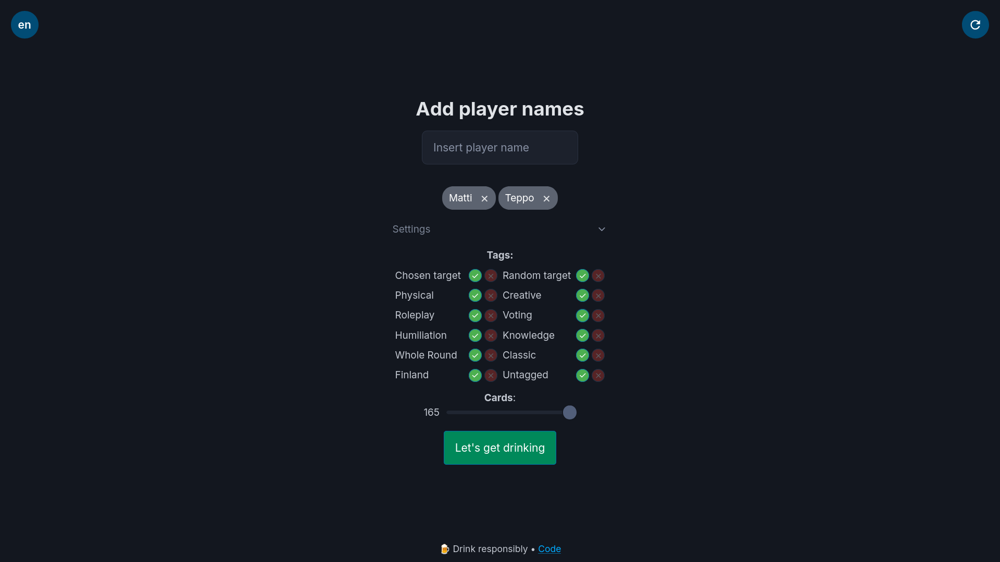
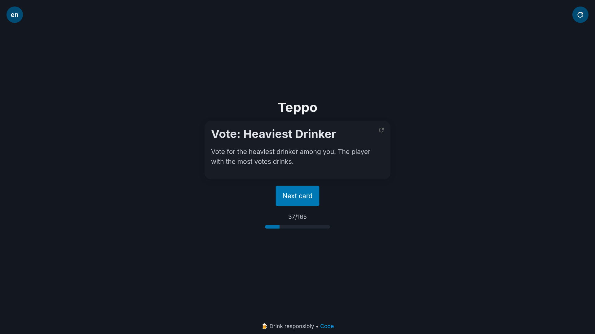

# 🍻 kalja-xyz
 [](../LICENSE)  [](https://kalja.xyz)

**The world's most blazingly fast drinking game platform**  
*Powered by [SvelteKit](https://svelte.dev/docs/kit/introduction) magic and questionable life choices*

🌐 **Play now:** [kalja.xyz](https://kalja.xyz)  
*(May induce "hold my beer" moments)* 🍺✋

<details>
<summary>Screenshots</summary>

**Start**
 

**Lobby**
 

**Start**
 
</details>


## ✨ Features
- 🍻 **90+ Cards**  
From "Sip" to "Strip" (okay, maybe not *that* kind of game)
- 🎚️ **Custom Rounds**  
Select your card quantity and mix the cocktail with tags.
- 🌍 **Bilingual Hangovers**  
Play in English or Finnish - regret knows no borders
- 📲 **Add to Home Screen (PWA)**  
Because bookmarks are for sober people


## 🛠️ Building
```bash
# Clone the repository
git clone https://github.com/NeuronActivation/kalja-xyz.git && cd kalja-xyz

# Install dependencies 
pnpm install

# Start development server
pnpm dev

```

<details>
<summary>❄️ Click here if you speak Nix</summary>
For those who like their toolchain like their vodka - pure and reproducible:

```bash
nix develop
```
</details>

## 🤝 Contributing

🃏 **Card Suggestions**  
Created a card that should come with a breathalyzer? Create an [issue](https://github.com/NeuronActivation/kalja-xyz/issues/new?template=card-suggestion.yml) - we'll drink to that idea! 🍻

🤓 **Code Contributions**  
Our cocktail recipe for clean code:
1. 🍹 **Shake well** - Run `pnpm format`
2. 📜 **Leave instructions** - TSDoc comments so we remember it tomorrow
3. 🧪 *Optional garnish* - Tests (like olives in a martini)


**Pro Tip:** All PRs are code-reviewed with a drink in hand 🥃 - the tipsier the review, the more creative the feedback!

## 🙏 Acknowledgments
🍻 **Original Inspiration**  
This project owes its existence to:
[**Juomapeli-App**](https://github.com/Santerhy/Juomapeli-App) - The Finnish drinking game pioneer

> *"Good artists copy, great artists get inspired and then accidentally create something completely different"*  
\- Probably Picasso after a few drinks

## 📜 License

Distributed under the `ANAL` License. See [LICENSE](../LICENSE) for more information.

