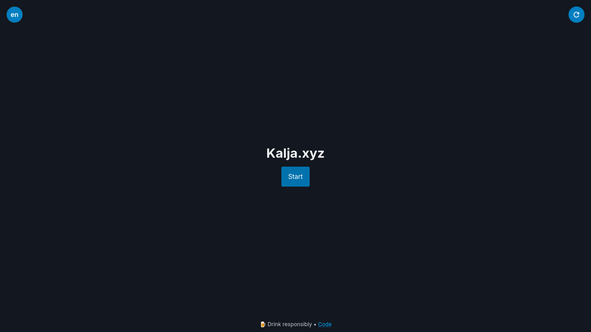
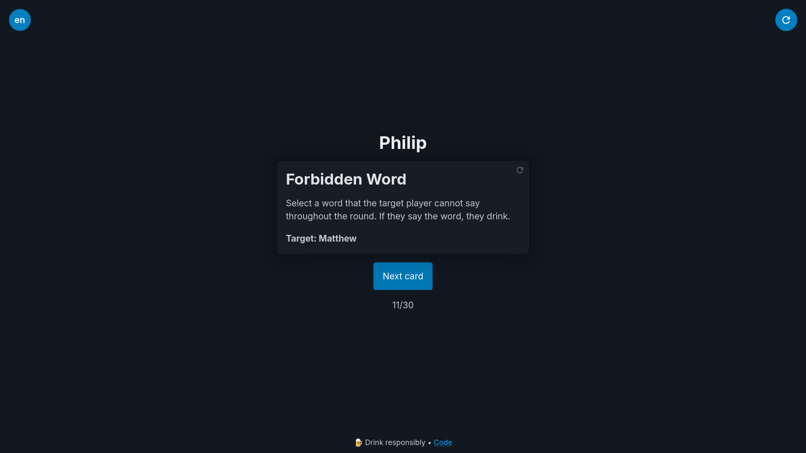

# 🍻 kalja-xyz
 [](../LICENSE)  [](https://kalja.xyz) 

**The world's most blazingly fast drinking game platform**  
*Powered by [SvelteKit](https://svelte.dev/docs/kit/introduction) magic and questionable life choices*

🌐 **Play now:** [kalja.xyz](https://kalja.xyz)  
*(May induce "hold my beer" moments)* 🍺✋

<details>
<summary>Screenshots</summary>

<b>Start</b><br>
 

<b>Lobby</b><br>
 

<b>Gameplay</b><br>
 
</details>


## ✨ Features
- 🍻 **150+ Cards**
From "Sip" to "Strip" (okay, maybe not *that* kind of game)
- 🎚️ **Custom Rounds**  
Select your card quantity and mix the cocktail with tags.
- 🌍 **Bilingual Hangovers**  
Switch dynamically between English or Finnish - regret knows no borders
- 📲 **Add to Home Screen (PWA)**  
Because bookmarks are for sober people
- 📊 **Privacy-Respecting Analytics**  
We count shots taken (metaphorically) without checking IDs. [View our public dashboard](https://cloud.umami.is/share/CrXiQx0T4O8Xjxy1/kalja.xyz)


## 🛠️ Building

>**Note:** We are using [Deno](https://docs.deno.com/runtime/getting_started/installation/) instead of NodeJS

```bash
# Clone the repository
git clone https://github.com/NeuronActivation/kalja-xyz.git && cd kalja-xyz

# Install dependencies 
deno install --allow-scripts

# Start development server
deno task dev

```

<details>
<summary>❄️ Click here if you speak Nix</summary>
For those who like their toolchain like their vodka - pure and reproducible:

```bash
nix develop
```
</details>

## 🤝 Contributing

🃏 **Card Suggestions**  
Created a card that should come with a breathalyzer? Create an [issue](https://github.com/NeuronActivation/kalja-xyz/issues/new?template=card-suggestion.yml) - we'll drink to that idea! 🍻

🤓 **Code Contributions**  
Our cocktail recipe for clean code:
1. 🍹 **Shake well** - Run `deno fmt`
2. 📜 **Leave instructions** - TSDoc comments so we remember it tomorrow
3. 🧪 **Optional garnish** - Tests, with vitest (like olives in a martini)


**Pro Tip:** All PRs are code-reviewed with a drink in hand 🥃 - the tipsier the review, the more creative the feedback!

## 🙏 Acknowledgments
🍻 **Original Inspiration**  
This project owes its existence to:
[**Juomapeli-App**](https://github.com/Santerhy/Juomapeli-App) - The Finnish drinking game pioneer

> *"Good artists copy, great artists get inspired and then accidentally create something completely different"*  
\- Probably Picasso after a few drinks

## 📜 License

Distributed under the `ANAL` License. See [LICENSE](../LICENSE) for more information.

